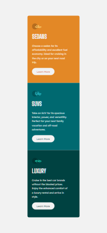

# Frontend Mentor - 3-column preview card component solution

This is a solution to the [3-column preview card component challenge on Frontend Mentor](https://www.frontendmentor.io/challenges/3column-preview-card-component-pH92eAR2-).

## Table of contents

- [Overview](#overview)
  - [The challenge](#the-challenge)
  - [Screenshot](#screenshot)
  - [Links](#links)
- [My process](#my-process)
  - [Built with](#built-with)
  - [What I learned](#what-i-learned)
  - [Continued development](#continued-development)
  - [Useful resources](#useful-resources)
- [Author](#author)
- [Acknowledgments](#acknowledgments)

## Overview

### The challenge

Users should be able to:

- View the optimal layout depending on their device's screen size
- See hover states for interactive elements

### Screenshot

### Links

- Solution URL: [Add solution URL here]
- Live Site URL: [Add live site URL here]

## My process

### Built with

- Semantic HTML5 markup
- CSS custom properties
- Flexbox
- Mobile-first workflow

### What I learned

In this project, I learned how to create a responsive design using Flexbox and CSS Grid. I improved my skills in using semantic HTML5 markup. One of the challenges was handling hover states for interactive elements, which I solved using CSS pseudo-classes.

### Continued development

In future projects, I plan to focus on improving my JavaScript skills and integrating more interactivity into my web applications. I also want to explore CSS animations and transitions to enhance user experience.

### Useful resources

- [MDN Web Docs](https://developer.mozilla.org/) - MDN provides comprehensive documentation and guides for web development. It was especially helpful in understanding CSS properties and JavaScript concepts.

## Author

- Frontend Mentor - [@sliyarli](https://www.frontendmentor.io/profile/sliyarli)

## Acknowledgments

I would like to acknowledge the Frontend Mentor community for creating these challenges and providing a platform for developers to improve their skills. Additionally, I found inspiration in the solutions and discussions on the Frontend Mentor platform, which helped me overcome challenges during this project.
